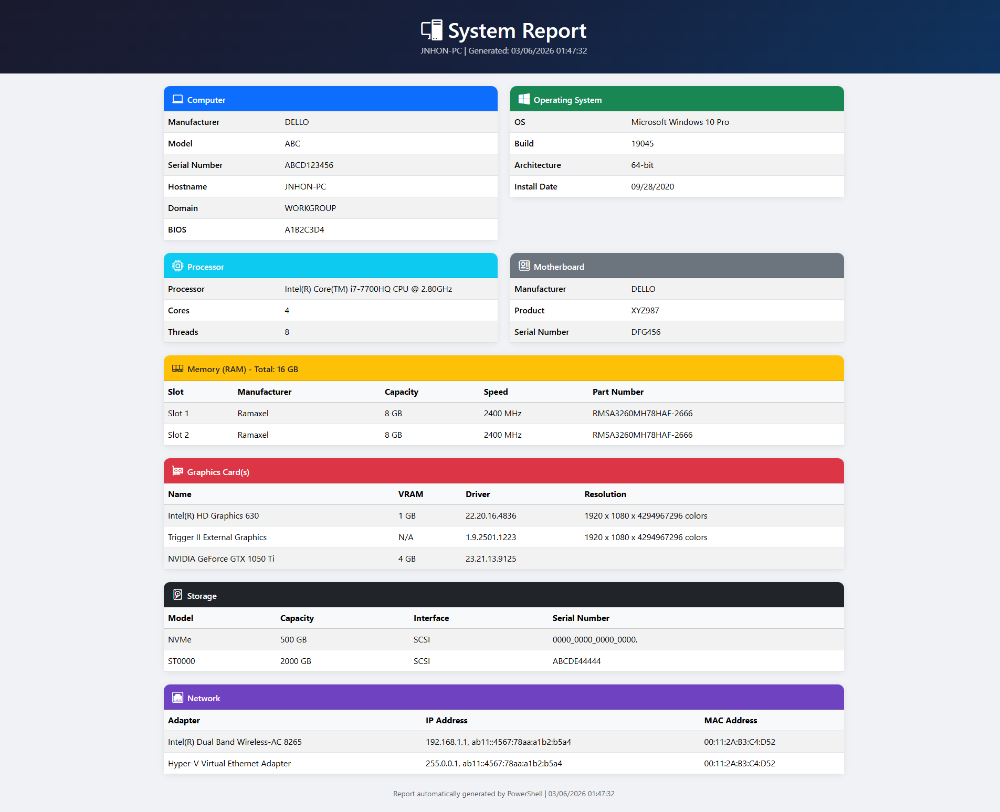

# SystemInfo - Hardware Report Generator

A lightweight PowerShell script that generates a clean, professional HTML report with your system's hardware and software specifications. Perfect for IT inventory, asset tracking, or simply documenting your machine's configuration.


## Preview

<p align="center">
  
</p>

## What It Collects

| Section | Details |
|---------|---------|
| **Computer** | Manufacturer, Model, Serial Number, Hostname, Domain, BIOS |
| **Operating System** | Name, Build, Architecture, Install Date |
| **Processor** | Model, Cores, Threads |
| **Motherboard** | Manufacturer, Product, Serial Number |
| **Memory (RAM)** | Per-slot: Manufacturer, Capacity, Speed, Part Number |
| **Graphics Card(s)** | Name, VRAM, Driver Version, Resolution |
| **Storage** | Model, Capacity, Interface, Serial Number |
| **Network** | Adapter Name, IP Address, MAC Address |

## Quick Start

### Option 1: Run directly
```powershell
powershell -ExecutionPolicy Bypass -File Get-SystemReport.ps1
```

### Option 2: Right-click
Right-click `Get-SystemReport.ps1` > **Run with PowerShell**

The report (`System-Report-<HOSTNAME>.html`) will be generated in the same folder and opened automatically in your default browser.

## Requirements

- Windows 10 / 11 / Server 2016+
- PowerShell 5.1 or later (pre-installed on Windows 10+)
- No external modules or dependencies

## Output

A single, self-contained HTML file styled with [Bootstrap 5](https://getbootstrap.com/) (loaded via CDN). You can:

- Open it in any browser
- Print it or save as PDF (`Ctrl + P`)
- Email it directly to your IT department
- Store it for asset documentation

## Use Cases

- **IT Asset Inventory** - Quick hardware documentation for onboarding/offboarding
- **Helpdesk Support** - Share system specs with support teams in seconds
- **Auditing** - Keep records of machine configurations
- **Personal** - Know exactly what's inside your machine

## License

This project is licensed under the MIT License - see the [LICENSE](LICENSE) file for details.
